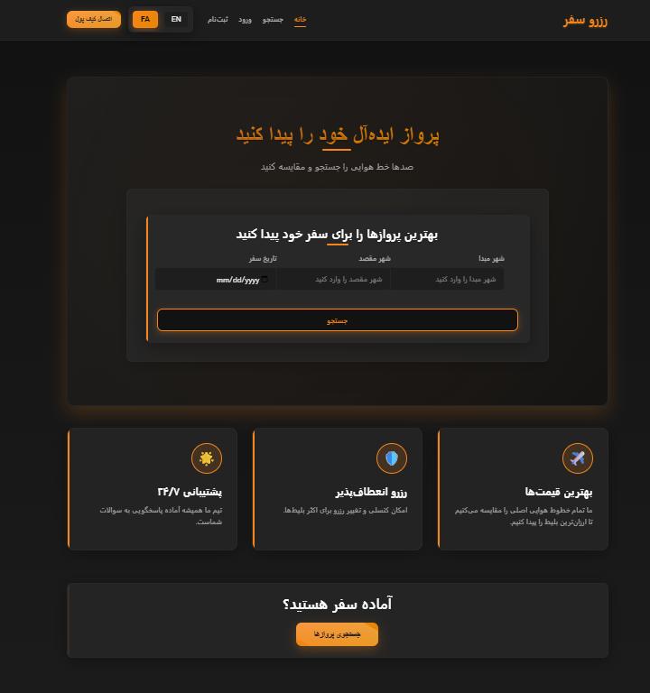
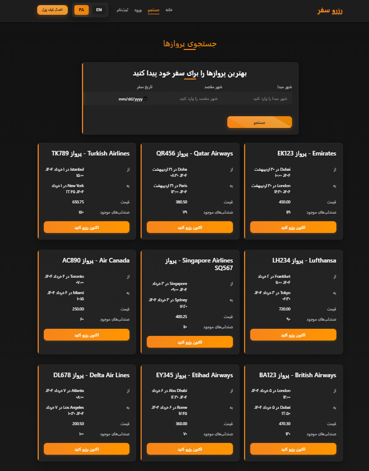
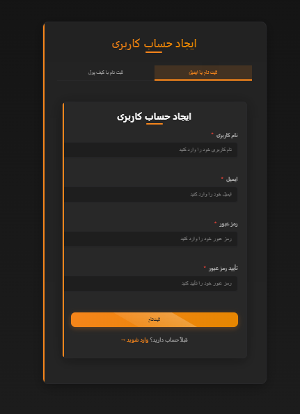
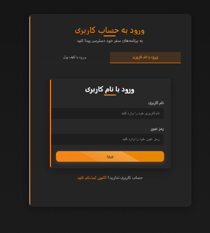
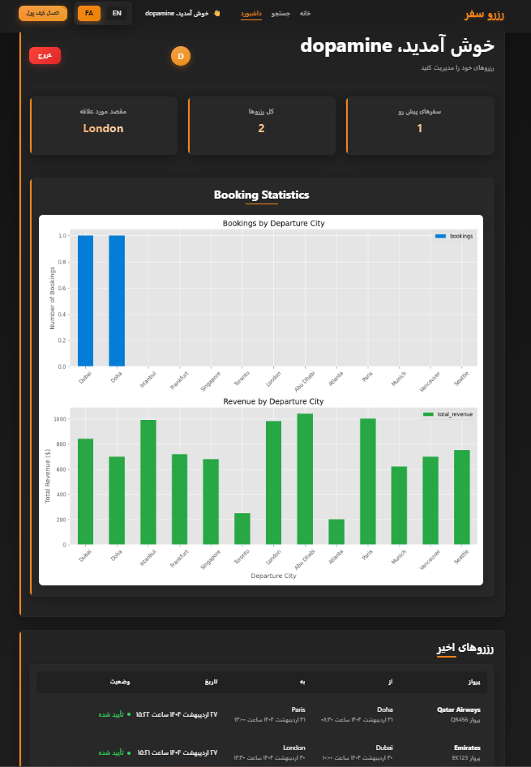

سامانه رزرو سفر
سامانه رزرو سفر یک پلتفرم آنلاین برای جستجو، رزرو و مدیریت پروازها با رابط کاربری مدرن و دو زبانه (فارسی و انگلیسی) است که با تکنولوژی‌های پیشرفته ساخته شده است.
ویژگی‌ها

جستجوی پروازها بر اساس مبدا، مقصد، تاریخ و کلاس پرواز  
رزرو و مدیریت بلیط‌ها از طریق داشبورد کاربر  
نمایش آمار رزروها با نمودار (Matplotlib)  
پشتیبانی از دو زبان فارسی و انگلیسی (React-i18next)  
اتصال به کیف پول MetaMask برای پرداخت امن  
طراحی شیشه‌ای و مدرن با الهام از MetaMask  
ریسپانسیو برای دسکتاپ، تبلت و موبایل  
احراز هویت و امنیت کاربران با JWT  
پایگاه داده MySQL برای ذخیره اطلاعات پروازها و کاربران

تکنولوژی‌ها
بک‌اند

Flask: فریم‌ورک وب پایتون برای APIها  
Pandas: تحلیل داده‌ها و پردازش رزروها  
MySQL: پایگاه داده برای ذخیره اطلاعات  
Matplotlib: تولید نمودارهای آماری

فرانت‌اند

React: ساخت رابط کاربری  
React-i18next: مدیریت چندزبانه (فارسی و انگلیسی)  
MetaMask SDK: اتصال به کیف پول MetaMask  
SCSS: استایل‌دهی با افکت شیشه‌ای  
Axios: ارتباط با APIهای بک‌اند

پیش‌نیازها

Python 3.8 یا بالاتر  
Node.js 16 یا بالاتر  
MySQL 8.0  
npm یا yarn  
کیف پول MetaMask (برای تست پرداخت)

نصب و راه‌اندازی
1. کلون کردن پروژه
git clone https://github.com/your-username/flight-booking-system.git
cd flight-booking-system

2. تنظیم بک‌اند
نصب وابستگی‌ها
cd backend
pip install -r requirements.txt

تنظیم پایگاه داده

MySQL را نصب و سرور را اجرا کنید.  
دیتابیس را بسازید:CREATE DATABASE flight_booking_db;

فایل db_connection.py را ویرایش کنید:host="localhost",
user="your_mysql_user",
password="your_mysql_password",
database="flight_booking_db"

دیتابیس را مقداردهی کنید:python -c "from db_connection import init_db; init_db()"

اجرای بک‌اند
python app.py

بک‌اند روی http://localhost:5000 اجرا می‌شود.
3. تنظیم فرانت‌اند
نصب وابستگی‌ها
cd frontend
npm install

تنظیم متغیرهای محیطی
فایل .env را در پوشه frontend بسازید:
REACT_APP_API_URL=http://localhost:5000

اجرای فرانت‌اند
npm start

فرانت‌اند روی http://localhost:3000 اجرا می‌شود.
4. اتصال به MetaMask

افزونه MetaMask را روی مرورگر نصب کنید.  
در صفحه ورود یا داشبورد، گزینه اتصال به کیف پول را انتخاب کنید.  
برای تست پرداخت، از شبکه تست (مثل Sepolia) استفاده کنید.

ساختار پروژه
flight-booking-system/
├── backend/
│   ├── database/
|   |   └── db_connection.py
│   ├── app.py
│   └── requirements.txt
├── frontend/
│   ├── src/
|   |   ├── assets/
|   |   ├── fonts/
|   |   ├── locals/
│   │   ├── components/
│   │   ├── pages/
│   │   ├── styles/
│   │   └── context/
│   ├── public/
│   └── package.json
└── README-fa.md

استفاده

به آدرس http://localhost:3000 بروید.  
ثبت‌نام کنید یا وارد شوید.  
از صفحه جستجو برای پیدا کردن پروازها استفاده کنید.  
رزروها را در داشبورد مدیریت کنید.  
برای پرداخت، کیف پول MetaMask را متصل کنید.

توسعه‌دهندگان
برای توسعه بیشتر، می‌توانید APIهای جدید به app.py اضافه کنید یا استایل‌ها را در frontend/src/styles تغییر دهید.
نیازمندی‌های اضافی

برای نمودارها، Matplotlib باید روی سرور بک‌اند نصب باشد.  
برای پشتیبانی از فارسی، فونت Samim باید در frontend/src/fonts باشد.

## نمونه تصاویر

لایسنس
MIT License
