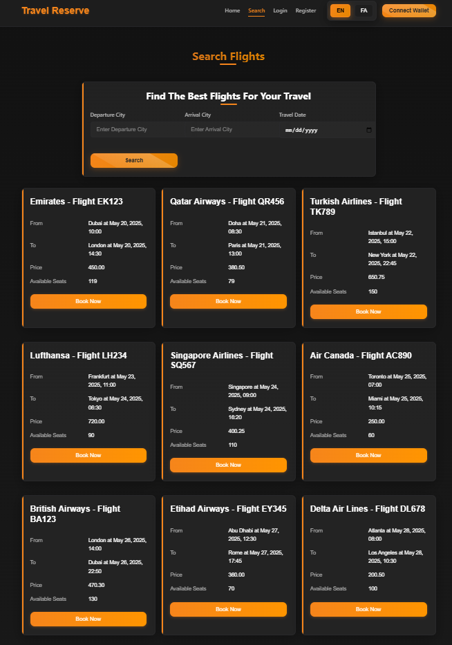
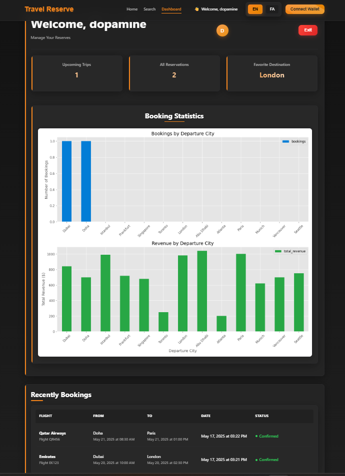

# Ticket Booking System

Ticket Booking System is an online platform for searching, booking, and managing flights with a modern, bilingual (Persian and English) interface built using advanced technologies.

## Features

- Search flights by origin, destination, date, and class  
- Book and manage tickets through the user dashboard  
- Display booking statistics with charts (Matplotlib)  
- Bilingual support for Persian and English (React-i18next)  
- Secure payments via MetaMask wallet integration  
- Glassmorphism design inspired by MetaMask  
- Responsive for desktop, tablet, and mobile  
- User authentication and security with JWT  
- MySQL database for storing flight and user data

## Technologies

### Backend

- [Flask](https://flask.palletsprojects.com/): Python web framework for APIs 
- Pandas: Data analysis and booking processing  
- MySQL: Database for storing data  
- Matplotlib: Generating statistical charts

### Frontend

- [React](https://reactjs.org/): Building the user interface
- React-i18next: Managing bilingual support (Persian and English)  
- MetaMask SDK: Wallet integration for payments  
- SCSS: Styling with glassmorphism effects  
- Axios: Communication with backend APIs

## Prerequisites

- Python 3.8 or higher  
- Node.js 16 or higher  
- MySQL 8.0  
- npm or yarn  
- MetaMask wallet (for payment testing)

## Installation and Setup

1. Clone the Project
- git clone https://github.com/your-username/flight-booking-system.git
- cd flight-booking-system

2. Backend Setup
- Install Dependencies
- cd backend
- pip install -r requirements.txt

### Database Configuration

- Install MySQL and start the server.  
- Create the database:CREATE DATABASE flight_booking_db;

# Edit db_connection.py:

- host="localhost",
- user="your_mysql_user",
- password="your_mysql_password",
- database="flight_booking_db"

- Initialize the database:python -c "from db_connection import init_db; init_db()"

- Run the Backend
- python app.py
# or
- flask run
- The backend will run on http://localhost:5000.

3. Frontend Setup
- Install Dependencies
- cd frontend
- npm install
- Configure Environment Variables
- Create a .env file in the frontend directory:
- REACT_APP_API_URL=http://localhost:5000

- Run the Frontend
- npm start

- The frontend will run on http://localhost:3000.

4. MetaMask Integration
- Install the MetaMask browser extension.  
- In the login or dashboard page, select the wallet connection option.  
- Use a test network (e.g., Sepolia) for payment testing.

## Project Structure

flight-booking-system/
├── backend/
│   ├── database/
|   |   └── db_connection.py
│   ├── app.py
│   └── requirements.txt
├── frontend/
│   ├── src/
|   |   ├── assets/
|   |   ├── fonts/
|   |   ├── locals/
│   │   ├── components/
│   │   ├── pages/
│   │   ├── styles/
│   │   └── context/
│   ├── public/
│   └── package.json
└── README.md

### Usage

- Navigate to http://localhost:3000.  
- Register or log in.  
- Use the search page to find flights.  
- Manage bookings in the dashboard.  
- Connect your MetaMask wallet for payments.

## Development
- For further development, you can add new APIs in app.py or modify styles in frontend/src/styles.
# Additional Requirements
- Matplotlib must be installed on the backend server for charts.  
- For Persian language support, the Samim font must be in frontend/src/fonts.

## Contributing
Pull requests are welcome. For major changes, please open an issue first to discuss what you would like to change.

## Screenshots

## License
MIT License
This project is licensed under the terms of the MIT license.